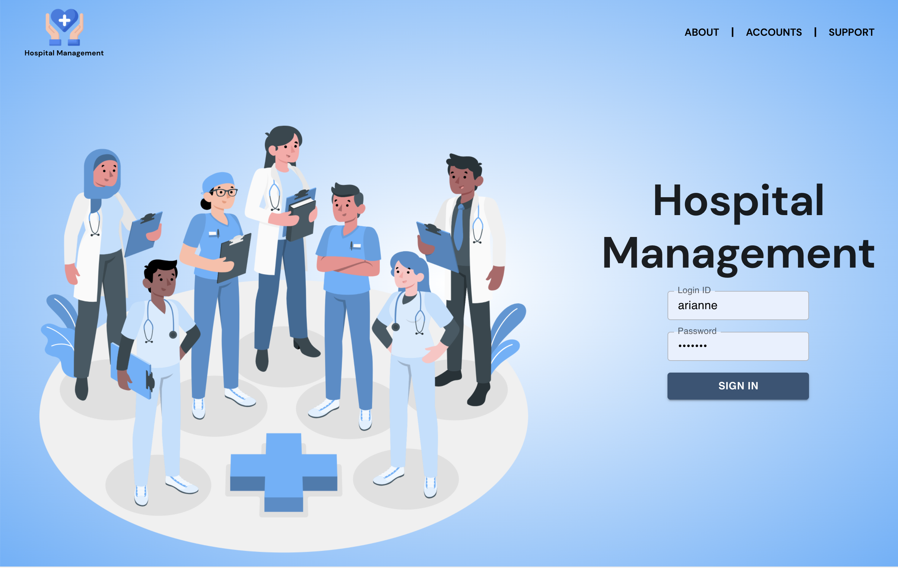
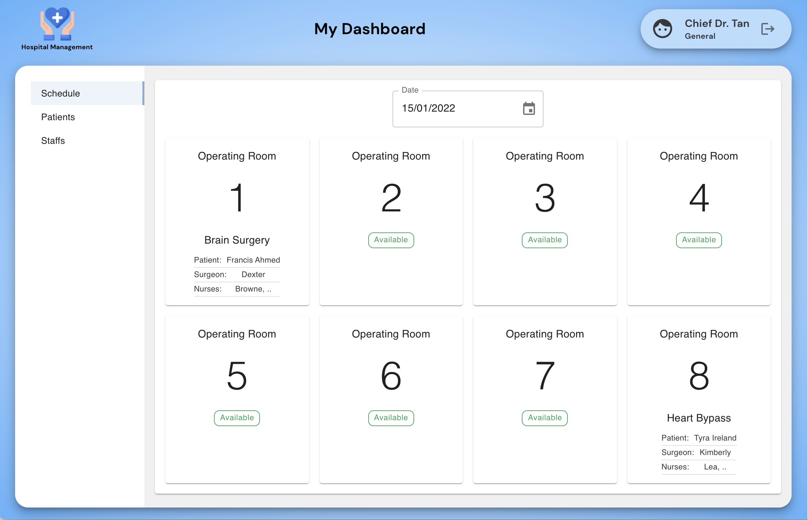
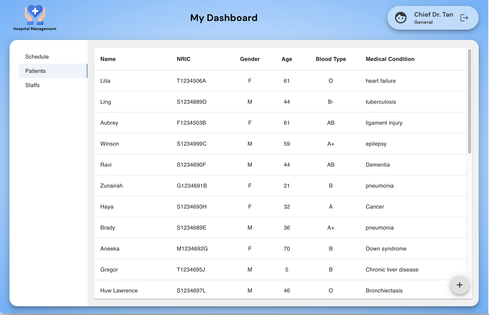
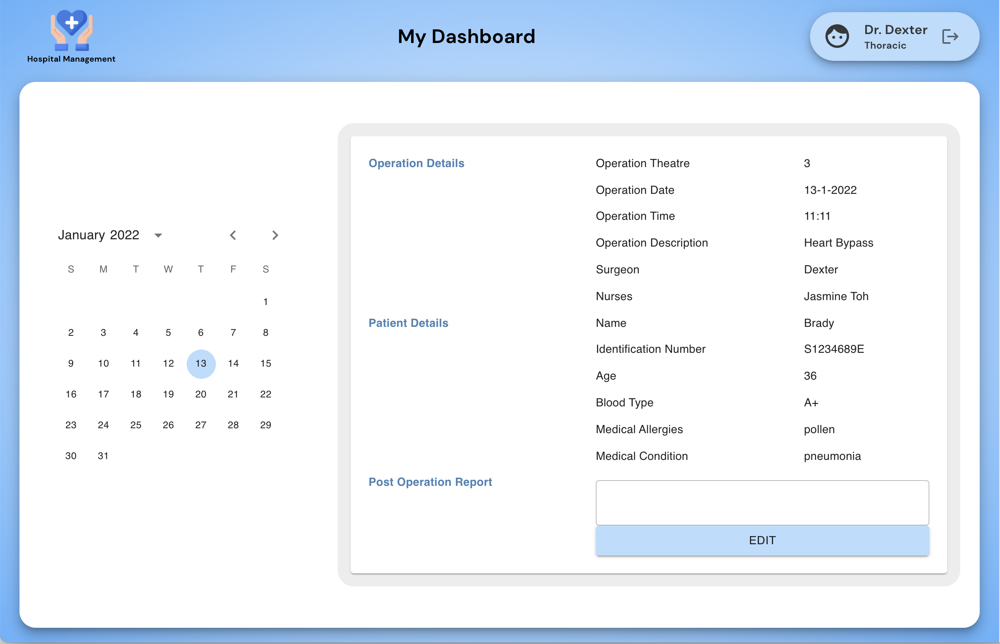

# GA Project 3 - MERN Stack

## Hospital Management Application
**Website: [Hospital Management](https://hospital-management-fe.herokuapp.com/)**

**Team members: Kien Wei, Yi Hui**

## Description

**Hospital Management** provides hospitals a platform to:

- schedule operations
- assign surgeons and nurses
- allow staffs(surgeons, nurses) to view their day to day assignments
- keep a record of operations, staffs, patients, post operation report

## Preview
This is the login page

Chief surgeons, also known as supercreators, have full CRUD capabilities that allows them to create/read/update/delete schedules, patients and staffs.

Staffs can only view operations assigned to them and update post operation reports

## User Stories
Go to ./public/GA_Project3 - User stories.docx of this repository folder.

## General Approach to Challenges
- Break down a function into a very simple function (i.e. logging out a string on the console) and incrementally build towards the main function.

## Unsolved Problems
- Display marks on staff's calender to indicate the dates where he/she is assigned an operation
- Prevent double booking of staffs on the same date and time

## Stretch Goals
- Chat feature that would allow communication within the operation team
- To breakdown operation schedules in terms of timeslots

## Backend
The backend files can be found in this [repository](https://github.com/yihuitham/GA-Project3-BackEnd)

## Attributions
[https://flat-icons.com](https://flat-icons.com)

[https://storyset.com](https://storyset.com/team)
