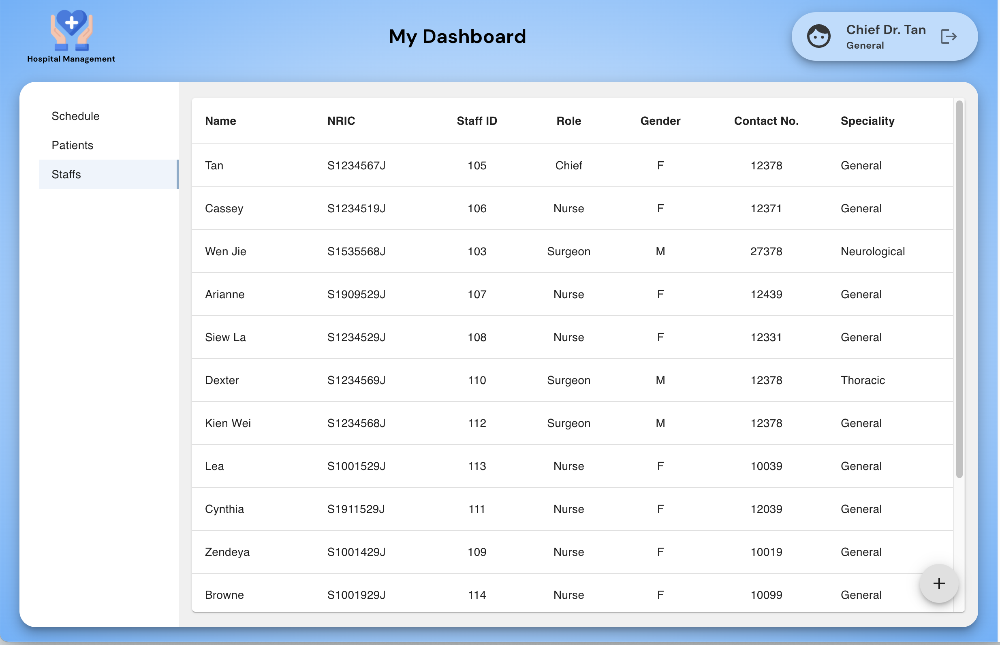

# GA Project 3 - MERN Stack

# Hospital Management Application
#### Website: [Hospital Management](https://hospital-management-fe.herokuapp.com/)

## Description

**Hospital Management** provides hospitals a platform to:

- schedule operations
- assign surgeons and nurses
- allow staffs(surgeons, nurses) to view their day to day assignments
- keep a record of operations, staffs, patients, post operation report

## Preview
Login page

Chief surgeons, also known as supercreators, have full CRUD capabilities that allows them to create/read/update/delete schedules, patients and staffs.

